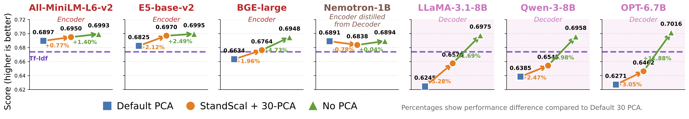
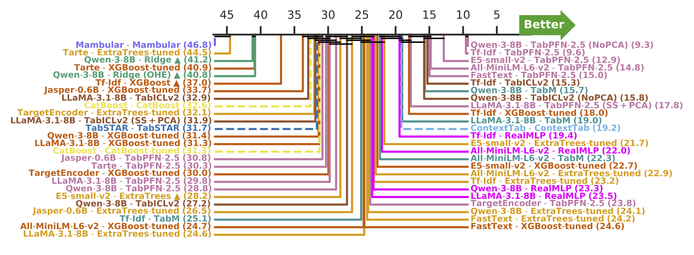
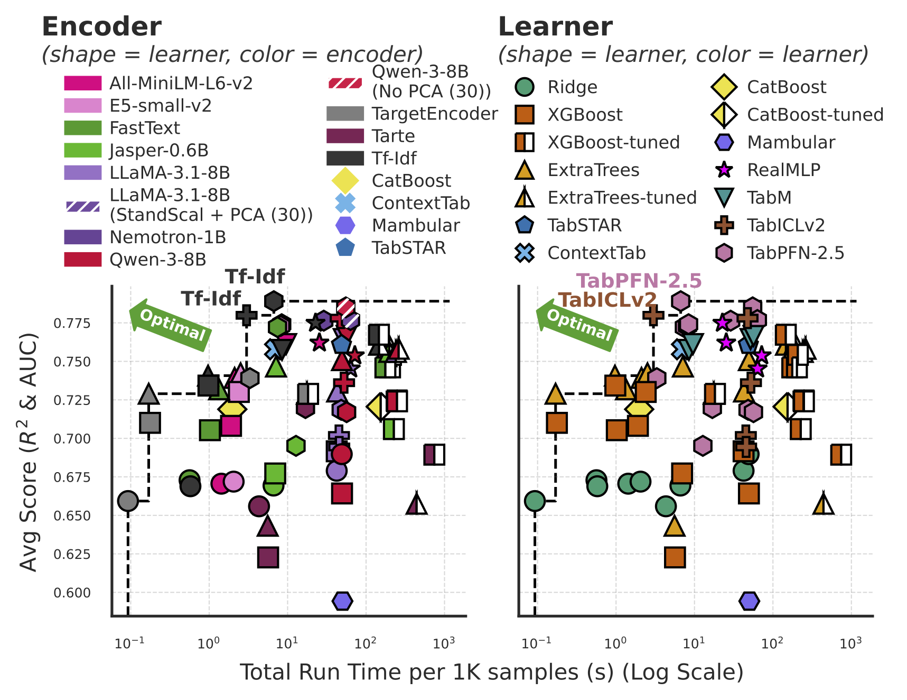

[](https://huggingface.co/datasets/inria-soda/STRABLE-benchmark)
[]({INSERT_ARXIV_LINK})

# STRABLE: Benchmarking Tabular Machine Learning with Strings

> **TL;DR** — STRABLE is a benchmark of **108 real-world tables with strings**. We evaluate modular pipelines that combine an **encoder** with a **learner**, as well as **end-to-end** architectures.

## 🔑 Key findings

- **Decoder-only LLM embeddings need the right post-processing.**


*Average score across 108 tables and five learners for 7 LM encoders under three post-processing variants (default 30-PCA, standard scaling + 30-PCA, no PCA).*

- **Modular pipelines (encoder + learner) outperform today's end-to-end string-tabular architectures.**


*Critical-difference diagram across the 108 datasets (lower rank = better). Solid lines: modular pipelines. Dashed lines: end-to-end models.*

- **Lightweight encoders paired with advanced learners dominate the Pareto frontier** is a consequence of STRABLE's string taxonomy: Categoricals 49%, Names 23%, Structured Codes 17%, Datetimes 2%, Identifiers 0.5% and only **8%** are Free Text.


*Trade-off between prediction performance and run time, colored by encoder on the left and by learner on the right. The dashed line is the Pareto frontier.*

---

## 🗂️ Repository layout

```text
strable/
├── configs/                            # Per-experiment config: paths, hparam grids, model registry
│   ├── exp_configs.py
│   ├── model_parameters.py
│   └── path_configs.py
├── data/
│   └── download_datasets.py            # Mirror the Hugging Face benchmark into data/data_processed/
├── figures/
│   ├── _main.py                        # Shared loaders, palettes, dtype/encoder/learner maps
│   ├── pareto_plot.png
│   ├── main_paper/                     # figure_1a, 1b, 2, 3, 4a, 4b, 5a–c, 6
│   └── appendix/                       # figure_C1, E1–E13 (with E4a, E4b)
├── scripts/
│   ├── download_datasets.py            # Same as data/download_datasets.py (CLI variant entrypoint)
│   ├── compile_results.py              # Per-fold scores → compiled CSV under results/compiled_results/
│   ├── compile_results_llm_times.py    # LLM embedding-extraction wall-clock summary
│   ├── datasets_metadata_recap.py      # Builds the 108-table metadata parquet
│   ├── datasets_representation.py      # Per-column structural meta-features (uniqueness, words/cell, …)
│   ├── embedding_extraction_scripts/   # Pre-compute LLM embeddings (default / FULL / feat-eng variants)
│   ├── evaluate_scripts/               # Pipeline & evaluation entry points (one per ablation)
│   ├── script_preprocess_data/         # 108 per-source preprocessing scripts (raw → data_processed/)
│   ├── script_data_modification/       # 75k subsample + feature-eng + raw-target-transform variants
│   ├── natural_language_test_VSE_vs_STRABLE_vs_CARTE_vs_TTB.py
│   ├── OHE_vs_passthrough_analysis_xgb.py
│   └── qwen-3-8b_matrioska_embedding_check.py
├── src/                                # Encoders, search, inference, learners, utils
│   ├── encoding.py                     # + encoding_{FULL,feature_eng,missing_val,skew,thres_*}.py
│   ├── llm_encoder.py
│   ├── inference.py
│   ├── param_search.py
│   ├── utils_evaluation.py
│   ├── utils_preprocess.py
│   └── utils_visualization.py
├── requirements.txt
├── pyproject.toml
└── LICENSE
```

`results/`, `results_pics/`, `results_compiled/`, and `data/data_processed*` are runtime-generated and gitignored.

---

## 🛠️ Step 1 – Install

Python **3.12**.

```bash
python3 -m venv .venv && source .venv/bin/activate
pip install -r requirements.txt
export STRABLE_ROOT=$(pwd)
export HF_TOKEN=hf_<your-token>
```

`HF_HOME` controls the Hugging Face cache (default `~/.cache/huggingface`).

> **ContextTab** — to use the ContextTab learner, follow the install instructions at <https://github.com/SAP-samples/sap-rpt-1-oss>.

---

## 💾 Step 2 – Get the data

Paths are wired automatically through [`configs/path_configs.py`](configs/path_configs.py).

### 2a. Default variant (Hugging Face) — 🤗

The main benchmark (108 preprocessed tables) is mirrored on the [`inria-soda/STRABLE-benchmark`](https://huggingface.co/datasets/inria-soda/STRABLE-benchmark) Hugging Face repository.

```bash
python data/download_datasets.py
```

This populates `data/data_processed/`.

### 2b. Ablation variants (Google Drive)

The three ablation variants are released as a single Drive bundle:

📦 <https://drive.google.com/file/d/1wq2edCjNUGi2uBwAKgGj5eikswmFxFEZ/view?usp=sharing>

| Variant CLI flag | Folder | Used by |
|---|---|---|
| `default` | `data/data_processed/` | `script_evaluate.py`, `script_evaluate_30_thres_*.py`, `script_evaluate_impute_missing_val.py` |
| `full` | `data/data_processed_FULL/` | `script_evaluate_FULL.py` |
| `feature-eng` | `data/data_processed_feature_eng/` | `script_evaluate_feature_eng.py` |
| `raw-targets` | `data/data_processed_skewness_inverse_transformation/` | `script_evaluate_skewness.py` |

```bash
python scripts/download_datasets.py                                           # default only
python scripts/download_datasets.py --variants default,full,feature-eng,raw-targets
```

### 2c. Re-running preprocessing from raw sources 🛠️

The Drive bundle does not include upstream raw files. To regenerate:

1. Get raw sources from the URLs in **Appendix C.4** of the paper.
2. Drop them under `<STRABLE_ROOT>/data/data_raw/<source>/<file>` to match each script's `data_path = …`.
3. Run:
   - [`scripts/script_preprocess_data/`](scripts/script_preprocess_data/) — for the default 108 tables.
   - [`scripts/script_data_modification/script_preprocess_subsample_75k/`](scripts/script_data_modification/script_preprocess_subsample_75k/) — for the tables subsampled to 75,000.
   - [`scripts/script_data_modification/script_preprocess_feature_eng/feature_engineering_performed/`](scripts/script_data_modification/script_preprocess_feature_eng/) — `feature-eng` variant for 43 datasets. Runs **on top of** `data/data_processed/` (i.e. after the default preprocessing), not on the raw sources.
   - [`scripts/script_data_modification/apply_inverse_label_transformation.py`](scripts/script_data_modification/apply_inverse_label_transformation.py) — `raw-targets` variant: undoes the default skewness transform on regression labels.

### 2d. Benchmarks comparison (CARTE / TTB / VSE)

Required only to reproduce the cross-benchmark appendix Figure E.1.

| Benchmark | Source | Layout |
|---|---|---|
| **CARTE** | [CARTE benchmark](https://tinyurl.com/carte-benchmark) | `data/CARTE_datasets/` |
| **TTB** | <https://github.com/mrazmartin/TextTabBench/tree/main/datasets_notebooks/paper_datasets> | `data/TTB_datasets/paper_datasets/` |
| **VSE** | <https://figshare.com/articles/dataset/Datasets_with_text_entries/24879042?file=43775007> | `data/VSE_datasets/` |

---

## 🚦 Pipeline

1. **Data** (Step 2 above).
2. **Pre-compute LLM embeddings** — only for LLM-encoder pipelines. CSV-based encoders (TableVectorizer / TargetEncoder / Tf-Idf) and end-to-end learners (ContextTab / TabSTAR / TabICLv2) do **not** need this step:
   ```bash
   python scripts/embedding_extraction_scripts/script_extract_llm_embeddings.py \
       -m llm-qwen3-8b -dn all-wide -ns 3 -fi all -dv cuda -cf False -oc False
   ```
3. **Run the experiment.** Each `scripts/evaluate_scripts/script_evaluate*.py` carries an `ABLATION` tag (`default`, `no-pca`, `ct30-ohe`, `ct30-passthrough`, `feature-eng`, `full-data`, `imputed`, `no-target-transform`). Output lands at:

   ```
   results/<ABLATION>/<save_dir>/<dataset>/<method_marker>/score/<marker>.csv
   ```

   Each variant takes the same core flags (`-dn -ns -m -fi -dv -cf -oc -ti -sd -norm -nopca -ndim --dry-run`); only `script_evaluate_impute_missing_val.py` adds `-mvp/--missing_val_policy`.

   ```bash
   python scripts/evaluate_scripts/script_evaluate.py \
       --save_dir benchmark_main -m num-str_tabvec_xgb \
       -dn all-wide -ns 3 -fi all -dv cpu -cf False -oc False -ti default
   ```
4. **Compile per-fold scores**:
   ```bash
   python scripts/compile_results.py default/benchmark_main
   # → results/compiled_results/result_default_benchmark_main.csv
   ```
5. **Figures**: one script per figure, runnable independently:
   ```bash
   python figures/main_paper/figure_3.py
   python figures/appendix/figure_E10.py
   ```
   Outputs land in `results_pics/<YYYY-MM-DD>/`.

---

## ⚡ Quickstart pipelines

Each block below is copy-paste runnable. Adjust `-dv cpu/cuda` for your hardware.

### 1. Fresh-environment setup

```bash
python3 -m venv .venv && source .venv/bin/activate
pip install -r requirements.txt
export STRABLE_ROOT=$(pwd)
export HF_TOKEN=hf_<your-token>
python scripts/download_datasets.py
```

### 2. Embedding extraction with a light LLM

```bash
python scripts/embedding_extraction_scripts/script_extract_llm_embeddings.py \
    -m llm-all-MiniLM-L6-v2 \
    -dn yelp_business beer-ratings \
    -ns 3 -fi all -dv cpu -cf False -oc False
```

### 3. End-to-end learner on one dataset

```bash
python scripts/evaluate_scripts/script_evaluate.py \
    --save_dir benchmark_main -m num-str_contexttab_contexttab \
    -dn yelp_business -ns 3 -fi 0 \
    -dv cpu -cf False -oc False -ti default
python scripts/compile_results.py default/benchmark_main
```

### 4. Light learner, tuned, on a few datasets

```bash
python scripts/evaluate_scripts/script_evaluate.py \
    --save_dir benchmark_main -m num-str_tabvec_xgb \
    -dn yelp_business beer-ratings ramen-ratings \
    -ns 3 -fi all -dv cpu -cf False -oc False -ti tune
python scripts/compile_results.py default/benchmark_main
```

### 5. Foundation-model learner with a light encoder

```bash
python scripts/evaluate_scripts/script_evaluate.py \
    --save_dir benchmark_main -m num-str_tabvec_tabpfn \
    -dn yelp_business beer-ratings ramen-ratings \
    -ns 3 -fi all -dv cuda -cf False -oc False -ti default
python scripts/compile_results.py default/benchmark_main
```

### 6. No-PCA ablation (Fig. E.4)

The no-PCA path is a flag on the main script; `--no_pca True` keeps the first `--n_dimensions` raw embedding dimensions instead of running PCA. Re-uses the same embeddings as the default run; only the post-encoding step differs. Results land under `results/no-pca/...`.

```bash
python scripts/evaluate_scripts/script_evaluate.py \
    --save_dir benchmark_main -m num-str_llm-qwen3-8b_tabpfn \
    -dn all-wide -ns 3 -fi all \
    -dv cuda -cf False -oc False -ti default \
    --no_pca True
python scripts/compile_results.py no-pca/benchmark_main
```

### 7. CT=30 routing (Fig. E.11)

Routes string columns with cardinality `<30` through OHE (Ridge) or passthrough (XGBoost / TabPFN); columns with cardinality `≥30` still go through the LLM encoder. Two scripts, one per learner family:

```bash
# OHE branch (Ridge)
python scripts/evaluate_scripts/script_evaluate_30_thres_OHE.py \
    --save_dir benchmark_main -m num-str_llm-llama-3.1-8b_ridge \
    -dn all-wide -ns 3 -fi all -dv cuda -cf False -oc False -ti default
python scripts/compile_results.py ct30-ohe/benchmark_main

# Passthrough branch (XGBoost / TabPFN)
python scripts/evaluate_scripts/script_evaluate_30_thres_lowcard_passthrough.py \
    --save_dir benchmark_main -m num-str_llm-llama-3.1-8b_xgb \
    -dn all-wide -ns 3 -fi all -dv cuda -cf False -oc False -ti default
python scripts/compile_results.py ct30-passthrough/benchmark_main
```

### 8. Full-data ablation (Fig. E.10)

Reads from `data/data_processed_FULL/` (un-subsampled tables); requires the matching embeddings extracted via the FULL-variant script.

```bash
python scripts/embedding_extraction_scripts/script_extract_llm_embeddings_FULL.py \
    -m llm-all-MiniLM-L6-v2 -dn all-wide -ns 3 -fi all -dv cuda -cf False -oc False

python scripts/evaluate_scripts/script_evaluate_FULL.py \
    --save_dir benchmark_main -m num-str_llm-all-MiniLM-L6-v2_xgb \
    -dn all-wide -ns 3 -fi all -dv cuda -cf False -oc False -ti default
python scripts/compile_results.py full-data/benchmark_main
```

### 9. Feature-engineering ablation (Fig. E.7)

Reads from `data/data_processed_feature_eng/`. Requires running the feature-eng-variant embedding script first.

```bash
python scripts/embedding_extraction_scripts/script_extract_llm_embeddings_feat_eng.py \
    -m llm-all-MiniLM-L6-v2 -dn all-wide -ns 3 -fi all -dv cuda -cf False -oc False

python scripts/evaluate_scripts/script_evaluate_feature_eng.py \
    --save_dir benchmark_main -m num-str_llm-all-MiniLM-L6-v2_xgb \
    -dn all-wide -ns 3 -fi all -dv cuda -cf False -oc False -ti default
python scripts/compile_results.py feature-eng/benchmark_main
```

### 10. Raw-target ablation (Fig. E.8)

Reads from `data/data_processed_skewness_inverse_transformation/`, where the default skewness transform on regression labels has been inverted back to the raw target.

```bash
python scripts/evaluate_scripts/script_evaluate_skewness.py \
    --save_dir benchmark_main -m num-str_tabvec_xgb \
    -dn all-wide -ns 3 -fi all -dv cpu -cf False -oc False -ti default
python scripts/compile_results.py no-target-transform/benchmark_main
```

### 11. Imputation ablation (Fig. E.9)

Adds `-mvp/--missing_val_policy` (`uniform_impute` or `none`). Mean imputation for numeric columns and mode for categorical, applied **after** the train/test split.

```bash
python scripts/evaluate_scripts/script_evaluate_impute_missing_val.py \
    --save_dir benchmark_main -m num-str_tabvec_xgb \
    -dn all-wide -ns 3 -fi all -dv cpu -cf False -oc False -ti default \
    -mvp uniform_impute
python scripts/compile_results.py imputed/benchmark_main
```

### 12. Dry-run on one dataset / one fold

```bash
python scripts/evaluate_scripts/script_evaluate.py --dry-run \
    --save_dir benchmark_main -m num-str_tabvec_ridge \
    -dn yelp_business -ns 3 -fi 0 \
    -dv cpu -cf False -oc False -ti default
```

---

## 🏷️ Method tokens (`-m / --method`)

Method strings have the form `<dtype>_<encoder>_<learner>`. The full enumeration of valid combinations lives in [`scripts/evaluate_scripts/METHOD_NAMES.md`](scripts/evaluate_scripts/METHOD_NAMES.md); display-name maps live in [`figures/_main.py`](figures/_main.py) (`dtype_map`, `encoder_map`, `learner_map`).

The `_default` / `_tune` suffix is appended automatically based on `-ti / --tune_indicator`; do **not** put it in `-m`.

---

## 📑 Citation

If you use STRABLE in your work, please cite:

```bibtex
@article{strable2026,
  title   = {STRABLE: Benchmarking Tabular Machine Learning with Strings},
  author  = {{INSERT_AUTHOR_LIST}},
  journal = {arXiv preprint},
  year    = {2026},
  url     = {{INSERT_ARXIV_LINK}}
}
```

## ⚖️ License

This project is released under the [BSD 3-Clause License](LICENSE).
